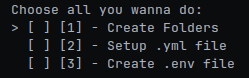
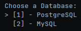

# Spring Boot CLI Helper

Simple Rust CLI tool for basic Spring Boot project setup.

---

## Description

This tool automates common setup steps in a Spring Boot project.

It can:
- find the main Spring Boot class (`*Application.java`)
- create a standard package structure
- handle configuration files
- support basic database setup for PostgreSQL and MySQL

This helper is useful when you want to speed up the initial backend structure creation and avoid repetitive manual setup.

---

## Features

### Package structure creation
The tool creates these folders inside your main Java package:
- `config`
- `controller`
- `repository`
- `entity`
- `mapper`
- `service`
- `service/impl`
- `exception`

### Config handling
The tool checks configuration files in `src/main/resources`:
- if `application.yml` already exists, it uses it
- if only `application.properties` exists, it renames it to `application.yml`
- if no config file exists, it can create a new `application.yml`

### Database setup
The tool can prepare basic configuration for:
- PostgreSQL
- MySQL

---

## Requirements

Before using this tool, make sure you have:
- [Rust & Cargo](https://www.rust-lang.org/tools/install) installed
- An existing Spring Boot project

**Optional but recommended:**
- Java 17+
- Maven or Gradle

---

## Installation & Setup

### Linux / macOS

#### 1. Install Rust
Go to the official Rust website: https://www.rust-lang.org/tools/install

Follow the instructions for Linux/macOS (usually running the provided curl command in your terminal). Follow the on-screen instructions to finish the setup. This will install both Rust and Cargo (the package manager).

#### 2. Download the Tool
Download the source code of this tool to your computer. You can either download the project as a ZIP file and extract it, or use `git clone` if you have Git installed:

`git clone https://github.com/LudekFiser/spring_boot_cli_helper.git`

#### 3. Build and Install
Open your terminal. Navigate to the folder where you extracted the tool and run this command:

`cargo install --path .`

*Note: if that doesn't work, use:*
`cargo install --path . --force`

This will automatically build the tool and install it globally on your system so you can use it from anywhere.

### Windows

#### 1. Install Rust
Go to the official Rust website: https://www.rust-lang.org/tools/install

Download the `rustup-init.exe` installer for Windows and run it. Follow the on-screen command prompt instructions to finish the setup. This will install both Rust and Cargo (the package manager).

#### 2. Download the Tool
Download the source code of this tool to your computer. You can either download the project as a ZIP file and extract it, or use `git clone` if you have Git installed:

`git clone https://github.com/LudekFiser/spring_boot_cli_helper.git`

#### 3. Build and Install
Open **Command Prompt** or **PowerShell**. Navigate to the folder where you extracted the tool and run this command:

`cargo install --path .`

*Note: if that doesn't work, use:*
`cargo install --path . --force`

This will automatically build the tool and install it globally on your system so you can use it from anywhere.

---

## Usage

1. Open your terminal or command prompt.
2. Navigate to the root folder of your existing Spring Boot project (the folder containing your `pom.xml` or `build.gradle`).
3. Run the tool by typing:

`spring-helper`

The tool will start and guide you through the setup process.

### Interactive menu

Use:
- (UP, DOWN) arrows to navigate
- SPACE to select/deselect options
- ENTER to confirm your selection

You can:
- select one option
- select multiple options
- or select nothing (the program will exit)

---

If you choose to Setup the .yml file, you will be then asked to choose between MySQL or PostgreSQL so that it can insert the correct database url and driver.

